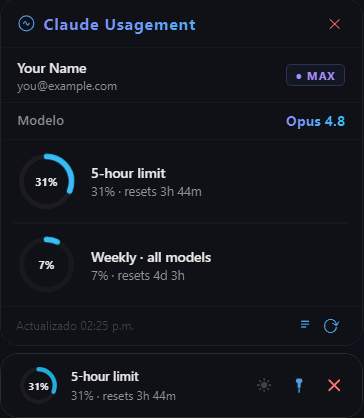

# Claude Usagement

An always-on-top desktop widget for Windows that shows your Claude plan usage in real time — 5-hour limit, weekly usage, and extra credits.

<!-- Add a screenshot or preview.gif here and reference it:  -->

## Getting started

The whole setup is three steps. You never type your Claude password into this widget — it reads the credentials that Claude Code already stores on your machine after you log in.

### 1. Install Claude Code and log in

The widget rides on top of the **Claude Code CLI**, so you need it installed and logged in once. This is what links the widget to your Claude account.

```
npm install -g @anthropic-ai/claude-code
claude login
```

`claude login` opens your browser, you sign in to your Claude account, and it saves a credential file locally (`~/.claude/.credentials.json`). That's the account link — nothing else to configure.

> Don't have Node.js/npm? Install it first from [nodejs.org](https://nodejs.org). Already using Claude Code every day? You're already done with this step.

### 2. Download the widget

1. Go to [**Releases**](../../releases/latest)
2. Download `ClaudeUsagement-portable.exe`
3. Save it anywhere you like — it's a single portable file, no installer.

### 3. Run it

Double-click `ClaudeUsagement-portable.exe`. The widget appears on top of your screen and immediately shows your usage. Drag it to whatever corner you prefer — the position is remembered.

> **Windows SmartScreen warning?** Click "More info" → "Run anyway". This appears because the app isn't code-signed (a certificate costs ~$300/year). The source code is fully open — you can read every line in this repo before running it.

## How it works

The widget reads your credentials from `~/.claude/.credentials.json`, the exact same file the Claude Code CLI creates after `claude login`. There is no separate account, no password prompt, and nothing is sent anywhere except directly to Anthropic's own API to fetch your usage numbers. If you can run `claude` in a terminal, the widget just works.

## Features

- Live 5-hour limit and weekly usage with animated arc gauges
- Amber glow warning at 85%, red pulse at 100%
- Dynamic gradient colors per usage range
- Drag to any corner of your screen — position saved across restarts
- Dark / light theme toggle
- Always-on-top with pin/unpin
- Auto-refreshes every 2 minutes, plus automatically at your exact reset time

## Build from source

Prefer to build it yourself instead of downloading the release? You need [Node.js](https://nodejs.org) installed.

```
git clone https://github.com/cgabrielbg7/claude-usagement
cd claude-usagement
npm install
npm start          # run in dev mode
npm run build      # build portable .exe → dist/
```

## Contributing

Pull requests are welcome. The `main` branch is protected, so fork the repo, create a branch, and open a PR — direct pushes are disabled.

## License

MIT — see [LICENSE](LICENSE).
